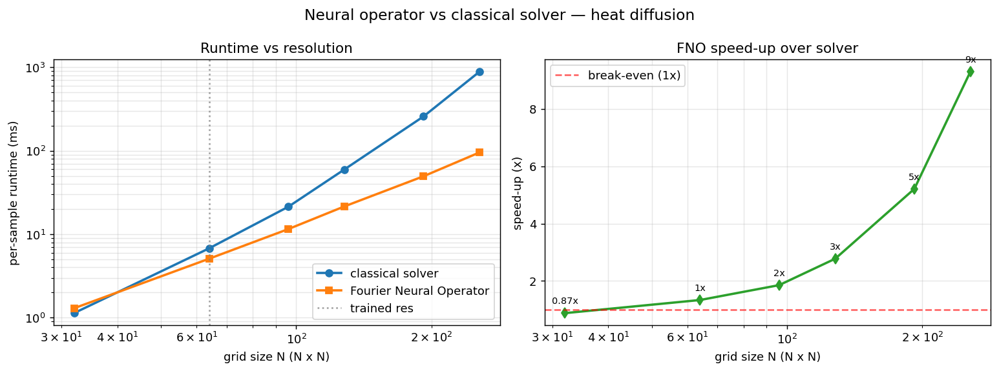
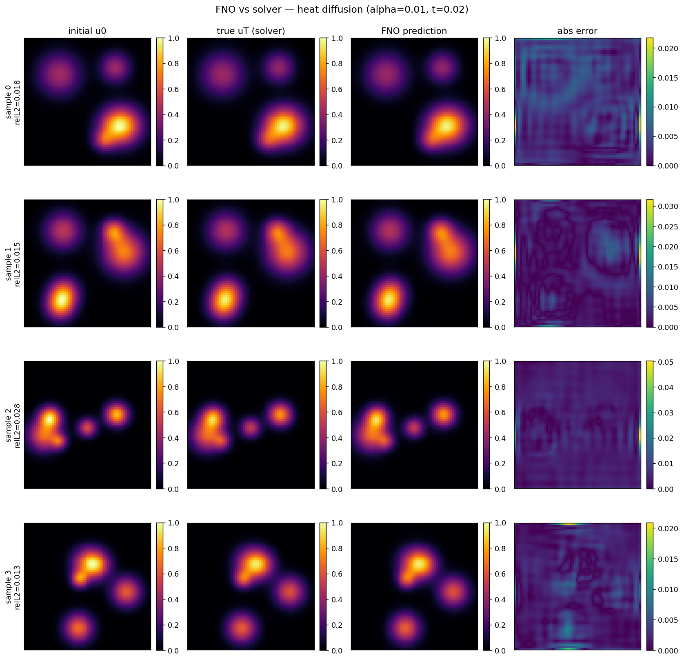
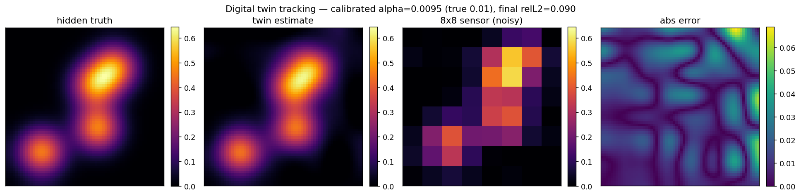

# Neural Operators for Heat Diffusion

*Fast learned PDE surrogates, physics-informed inverse calibration, and a
digital twin — with heat diffusion as the test system.*

## Research question

> Can a **Fourier Neural Operator** trained on simulated physics transfer to
> real, noisy, unknown-boundary measurements — and if not, how is the
> **sim-to-real** gap closed?

The neural-operator literature is validated almost entirely on clean simulated
data. The aim here is to study transfer to a real measurement, using a cheap
**8×8 thermal sensor (AMG8833)** on a metal plate as the physical reference.

## Result: the FNO is up to 9× faster than the classical solver

An FNO trained for a `t=0.5` horizon outperforms the classical
finite-difference solver **at matched accuracy** (val relative L2 ≈ 0.0197),
and the speed-up **grows with resolution**: the stability-limited solver costs
~O(N⁴) while the FNO costs ~O(N² log N). All measured on **CPU, no GPU**.



| grid | solver | FNO | speed-up |
|---:|---:|---:|---:|
| 64×64 | 6.8 ms | 5.1 ms | **1× (break-even)** |
| 128×128 | 59.8 ms | 21.6 ms | **3×** |
| 192×192 | 258 ms | 49.5 ms | **5×** |
| 256×256 | 890 ms | 95.7 ms | **9×** |

> Regime note: at a **short** horizon (`t=0.02`) the trivial solver is still
> faster (FNO 0.04–0.48×). The FNO wins where the problem is expensive: high
> resolution, long horizons, harder PDEs, GPU, or many-query settings. Details:
> [docs/benchmark.md](docs/benchmark.md).

The FNO prediction is visually indistinguishable from the solver:



## Digital twin: full field from a cheap sensor

`digital_twin.py` is a working digital-twin prototype — a live virtual replica
of a heat-diffusing object that does three things:

1. **Calibration** — recovers the physics (diffusivity α) from observations.
   Two routes: (a) a fast closed-form finite-difference least-squares estimate
   (**4.8% error** on clean data); (b) `pinn.py`, a **noise-robust** two-phase
   estimator that first fits a smooth **neural field** to the data (phase 1 has
   no physics loss, so it is a coordinate network, not a PINN), then reads α off
   its autodiff derivatives via the PDE least-squares
   `α̂ = Σ(∇²u·∂ₜu) / Σ(∇²u)²` (**~1–2% error**, avoiding the α-drift of the
   naive jointly-optimised inverse PINN).
2. **Assimilation** — fuses a low-resolution **noisy 8×8** sensor reading into
   the full field with a coarse-scale correction that preserves the
   physics-driven fine structure.
3. **Forecasting** — advances the state in time (fast FNO or the solver).

In the live loop the twin tracks the **hidden, full-resolution ground truth**
while seeing only the cheap 8×8 sensor — at **3–9% relative L2**:



## Inverse calibration: an observed identifiability issue

The naive inverse PINN — a flexible network and a trainable α optimised jointly
— is poorly conditioned on this problem: because the weights and α move
together, the network can fit the snapshots with its own flexibility instead of
diffusion, so α drifts toward 0. (We document this systematically; the
conditioning of PINN parameter estimation is a known topic, not claimed as new.)
The two-phase estimator in `pinn.py` decouples the fit (well-posed regression on
a neural field) from the parameter read-out (closed-form least squares on
autodiff derivatives), which in our experiments converges stably to within
~1–2% of the true α (not strictly monotone — a small late overshoot is visible).

## Layout

```
.
├── requirements.txt
├── src/
│   ├── simulate.py      # 2D heat-diffusion finite-difference solver (ground truth)
│   ├── dataset.py       # generates (u0 -> uT) training pairs
│   ├── model.py         # Fourier Neural Operator (2D FNO)
│   ├── train.py         # training loop + relative L2 evaluation
│   ├── predict.py       # visualisation: u0 | true uT | FNO prediction | error map
│   ├── compare_speed.py # benchmark: FNO vs classical solver (time + accuracy)
│   ├── pinn.py          # physics-informed inverse calibration (recover α)
│   ├── digital_twin.py  # digital twin: calibrate + assimilate + forecast
│   ├── experiments.py   # multi-seed studies (F1 calibration vs noise, F2 tracking)
│   └── serve.py         # FastAPI web demo: FNO vs solver, live, in the browser
└── sensor/
    └── read_amg8833.py  # 8x8 thermal-sensor reader (MicroPython / ESP32)
```

## Usage

```bash
pip install -r requirements.txt

# Standalone smoke tests
python src/simulate.py      # checks energy conservation (Neumann boundary)
python src/model.py         # parameter count + resolution invariance
python src/dataset.py --samples 200 --out data/heat_dataset.npz

# Training (data generated on the fly if --data is omitted)
python src/train.py --samples 1000 --epochs 50
# or from a pre-generated dataset:
python src/train.py --data data/heat_dataset.npz --epochs 50

# Visualise a trained model
python src/predict.py --n-samples 4 --out outputs/predictions.png

# Benchmark: FNO vs classical solver (reproduces the 9× speed-up)
python src/train.py --samples 600 --epochs 25 --t-final 0.5 \
    --out checkpoints/fno_heat_long.pt
python src/compare_speed.py --ckpt checkpoints/fno_heat_long.pt

# PINN inverse calibration: recover a hidden alpha from observations
python src/pinn.py --true-alpha 0.01

# Digital twin: track the full field from a noisy 8x8 sensor (+ figure)
python src/digital_twin.py --plot outputs/digital_twin.png

# Web demo (open http://127.0.0.1:8000): generate a heat source, predict it,
# and watch the FNO beat the solver live. SERVE_GRID sets the demo resolution.
python src/serve.py
# at 256x256 the FNO is ~8x faster than the solver at matched accuracy
```

A trained FNO reaches validation relative L2 ≈ 0.016 from 500 samples / 20
epochs on CPU, matching the canonical FNO benchmark target (< 2%).

## The physics

The 2D heat equation on the unit square `[0,1]²`:

```
du/dt = alpha * laplace(u)
```

The explicit scheme is stable while `alpha * dt * (1/dx² + 1/dy²) <= 0.5`; the
solver enforces this automatically (the `cfl` parameter). Boundaries are
zero-Neumann (insulated) by default, so total heat is conserved — a useful
correctness check.
