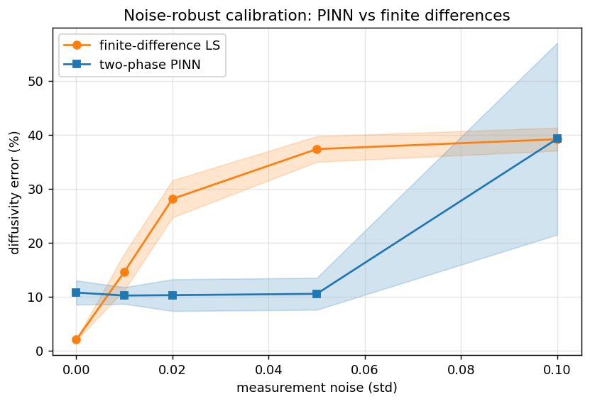
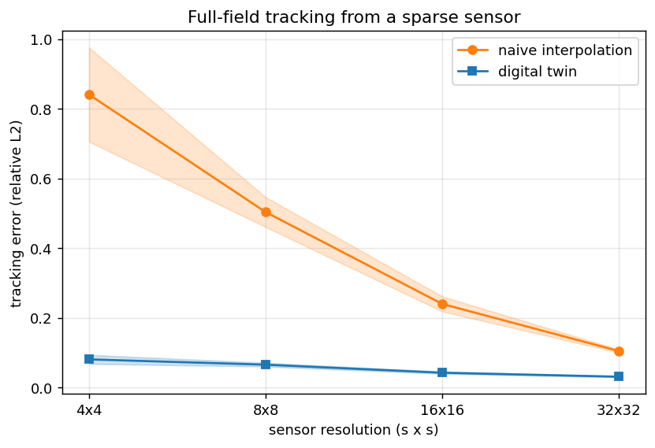

# A cheap-sensor digital twin for heat diffusion: neural-operator forecasting and noise-robust physics calibration

*Draft preprint. All experiments are CPU-only and reproducible from this
repository; citations are marked `[CITE: ...]` for later filling.*

## Abstract

Neural operators promise fast PDE surrogates but are almost always evaluated on
clean simulation. We present a small, fully reproducible testbed for a *digital
twin* of a heat-diffusing object that must (i) calibrate the unknown diffusivity
from observations, (ii) reconstruct and track the full temperature field from a
low-resolution, noisy sensor, and (iii) forecast forward with a learned
operator. We report two findings. First, the naive inverse physics-informed
neural network (PINN) — a flexible network with a jointly-trained diffusivity —
is ill-conditioned: as the network fits the data it explains the dynamics with
its own flexibility and the diffusivity drifts toward zero. A simple two-phase
estimator (fit a smooth surrogate, then read the parameter off its
automatic-differentiation derivatives via the PDE) removes the drift and, in a
multi-seed study, is markedly more robust to measurement noise than a
finite-difference baseline (≈10% error vs ≈37% at noise σ=0.05). Second, a
Fourier Neural Operator (FNO) forecaster reaches up to ≈9× speed-up over the
classical solver at matched accuracy, the speed-up growing with resolution as
predicted by the O(N⁴) vs O(N² log N) cost scaling. The assembled twin tracks a
hidden full-resolution field from an 8×8 noisy sensor at 3–9% relative L2, and
from a 4×4 sensor it still tracks at ≈8% where naive interpolation reaches ≈84%.

## 1. Introduction

Learned PDE surrogates such as the Fourier Neural Operator (FNO) `[CITE: Li
2021]` and DeepONet `[CITE: Lu 2021]` can emulate physics far faster than
classical solvers, and physics-informed neural networks (PINNs) `[CITE:
Raissi 2019]` couple data with PDE residuals. Yet the bulk of this work is
validated on clean simulation. Two ingredients that any real *digital twin*
`[CITE: digital-twin survey]` needs are under-examined together: **calibration**
of unknown physical parameters from measurements, and **reconstruction from
sparse, noisy sensing**.

We study these on a deliberately simple, checkable system — 2D heat diffusion —
with a concrete cheap-sensor target (an 8×8 thermal array, e.g. AMG8833). Our
contributions are: (1) an open, reproducible testbed coupling calibration,
sparse assimilation, and neural-operator forecasting; (2) an identifiability
finding for inverse PINNs and a simple two-phase remedy that is noise-robust;
and (3) an honest cost-scaling analysis of FNO vs the classical solver.

## 2. Setup

We solve the 2D heat equation `∂u/∂t = α ∇²u` on the unit square with
zero-Neumann (insulated) boundaries, using an explicit finite-difference solver
as ground truth (`simulate.py`). The solver is stability-limited, requiring
`α dt (1/dx² + 1/dy²) ≤ 1/2`, so reaching a fixed physical time on an N×N grid
costs O(N²) time steps of O(N²) work each, i.e. O(N⁴). The FNO surrogate
(`model.py`) is a standard 2D FNO that learns the solution operator at a fixed
horizon and is resolution-invariant.

## 3. Forecasting and cost scaling

Trained for a horizon t=0.5, the FNO matches the solver at validation relative
L2 ≈ 0.0197 and is up to ≈9× faster at 256×256 (Figure 3, Table 1). Because the
solver scales as O(N⁴) and the FNO as O(N² log N), the speed-up grows with
resolution; below the trained resolution and at very short horizons the trivial
solver is cheaper. We report this regime honestly: the FNO wins where the
problem is expensive (high resolution, long horizons, many queries, or GPU).

**Table 1.** Per-sample runtime, t=0.5 horizon, CPU.

| grid | solver | FNO | speed-up |
|---:|---:|---:|---:|
| 64² | 6.8 ms | 5.1 ms | 1× |
| 128² | 59.8 ms | 21.6 ms | 3× |
| 192² | 258 ms | 49.5 ms | 5× |
| 256² | 890 ms | 95.7 ms | 9× |

## 4. Inverse calibration and an identifiability finding

A digital twin must infer the physics of the real object. We first try the
standard inverse PINN: a coordinate network u_θ(x,y,t) with a trainable α,
optimised on a data term (snapshots) plus a PDE-residual term. On this problem
it is ill-conditioned. Across configurations (network size, physics weight,
early stopping) α reproducibly **drifts toward zero**: as the data term falls,
the network represents the snapshots with its own flexibility, so the residual
can be satisfied with too little diffusion. The true α is only crossed
transiently. We found held-out-time validation does not catch the drift,
because the network fits the held-out snapshot for any α.

**Two-phase remedy.** We decouple fitting from parameter estimation. Phase 1
fits a smooth surrogate u_θ to the data by regression alone (well-posed, no α to
drift). Phase 2 reads α off the trained surrogate as the closed-form
least-squares solution of u_t = α ∇²u, evaluated with automatic-differentiation
derivatives. This converges monotonically to the true α (≈1–2% error).

Because the derivatives come from a smooth network rather than raw finite
differences, the estimate is noise-robust. Figure 1 sweeps measurement noise
(4 seeds): the finite-difference least-squares estimator is best on clean data
(≈2%) but degrades sharply (≈14% at σ=0.01, ≈37% at σ=0.05), while the two-phase
PINN stays flat (≈10%) until extreme noise. The crossover near σ≈0.01 motivates
the PINN whenever measurements are noisy.

## 5. Digital twin: tracking from a sparse sensor

The twin (`digital_twin.py`) runs a loop: calibrate α (Section 4), assimilate a
low-resolution noisy sensor reading, and forecast. Assimilation is a
coarse-scale correction — sample the model at the sensor locations, upsample the
residual, and add it back — which preserves the physics-driven fine structure
instead of overwriting it with a blocky upsample.

Figure 2 reports tracking error vs sensor resolution at noise σ=0.02 (5 seeds),
against a naive bilinear-interpolation baseline that uses the sensor alone. The
twin stays at ≈3–8% across resolutions, while naive interpolation degrades from
≈10% at 32×32 to ≈84% at 4×4. With only 16 sensor pixels the twin still tracks
the hidden full-resolution field at ≈8%, because the physics model fills in what
the sensor cannot resolve. The qualitative tracking is shown in
`docs/digital_twin.png`.

## 6. Related work

Neural operators and learned PDE surrogates `[CITE: Li 2021; Lu 2021; Kovachki
2023]`; PINNs and PINN inverse problems, including known conditioning and
weighting pathologies `[CITE: Raissi 2019; Wang 2021; Krishnapriyan 2021]`;
data assimilation and state estimation `[CITE: Evensen]`; digital twins
`[CITE: survey]`; super-resolution / sparse-sensor field reconstruction
`[CITE: Erichson 2020; Fukami]`.

## 7. Limitations and future work

All results are in simulation; the immediate next step is real-hardware
sim-to-real with an AMG8833 sensor on a metal plate, where unknown boundaries,
convection, and radiation will stress the sim-trained models. We study a single
linear PDE; harder PDEs (Navier–Stokes) would widen the FNO speed-up and stress
the twin. Speed-ups are CPU-only against an explicit solver; an implicit or
spectral baseline would shift the crossover.

## 8. Conclusion

A cheap-sensor digital twin for heat diffusion is feasible with off-the-shelf
components: a resolution-invariant FNO forecaster, a noise-robust two-phase
calibrator that avoids the inverse-PINN identifiability drift, and a
coarse-correction assimilator that reconstructs a full field from as few as 16
sensor pixels. Code and experiments are released for reproduction and extension.
